# Cloud Native Pipeline 


O Cloud Native Pipeline tem como objetivo provisionar um ambiente completo de CI/CD com o OpenShift Pipelines, OpenShift GitOps, Gitea, Sonarqube e Nexus, assim como o repositório de código fonte de uma aplicação de exemplo EAP e o repositório de configuração de insfraestrutura da aplicação. Será utilizada a ferramenta Helm que seu uso é destinado para automatizar a criação, o empacotamento, a configuração e a implantação de aplicativos e serviços em clusters do Kubernetes 

Esta solução irá provisionar:

* 4 Namespaces para CI/CD, desenvolvimento, homologação e produção
* OpenShift Pipelines (Tekton) para construir a imagem do aplicativo em cada commit do Git
* OpenShift GitOps (ArgoCD) - login com credencial do OpenShift
* Gitea git server (usuário/senha: `gitea`/`openshift`)
* Sonatype Nexus (usuário/senha: `admin`/`admin123`)
* SonarQube (usuário/senha: `admin`/`admin`)
* Git webhooks para disparar o CI pipeline

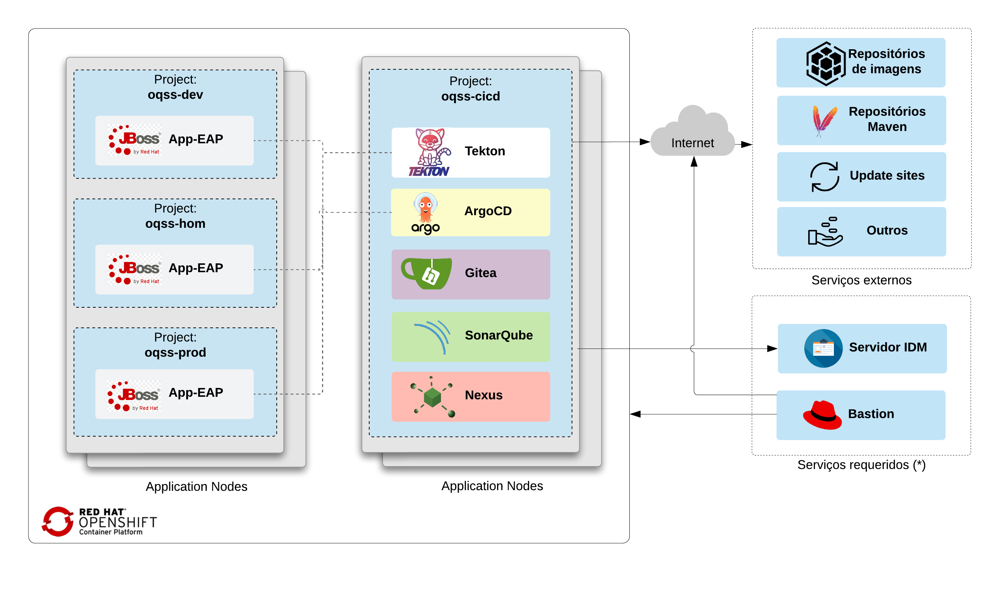


## Pré requisitos

* OpenShift Container Platform 4.9+

## Integração Contínua (CI)

Em cada push para o repositório git openshift-cicd-app-eap no servidor Gitea, as seguintes etapas são executadas no Pipeline:

- O código é clonado do servidor Gitea e o build é executado
- Testes unitários podem ser executados e em paralelo o código é analisado pelo SonarQube para antipadrões, e um relatório de dependência é gerado
- O aplicativo é empacotado como um WAR e lançado no repositório de artefatos do Sonatype Nexus
- Uma imagem de contêiner é criada no ambiente DEV ou HOM, dependo da branch, enviada para o *registry* interno do OpenShift e marcada com app-eap:latest
- Os manifests do Kubernetes são atualizados no repositório de configuração Git com o resumo da imagem que foi criado no pipeline
- Um pull-requested é criado no repositório de configuração para mesclar a atualização do resumo da imagem no ambiente PROD, esta etapa somente é executada para o ambiente de HOM

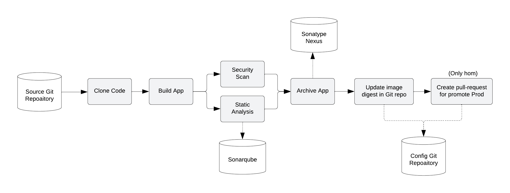

## Entrega Continua (CD)

O Argo CD monitora continuamente as configurações armazenadas no repositório Git e usa o Kustomize para sobrepor configurações específicas do ambiente ao implantar o aplicativo em ambientes DEV, HOM e PROD.

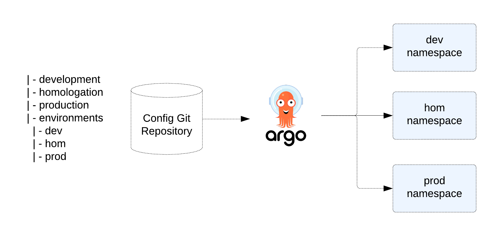


## Instalar infraestrutura com helm - ArgoCD, Gitea, Sonarqube e Nexus com helm

Primeiramente vamos instalar as ferramentas de apoio ao CI/CD como ArgoCD, Gitea, Sonarque e Nexus. Em seguida o Pipeline e todos seus recursos.

### Instalar o ArgoCD

Realizar o clone do repositório de infra.

```
git clone https://gitlab.consulting.redhat.com/consulting-brazil/applicationpractice/quick-starts/oqss/cnp/openshift-cicd-infra.git
Cloning into 'openshift-cicd-infra'...
```

Executar o comando abaixo para a instalação do OpenShift GitOps - ArgoCD.

```
cd openshift-cicd-infra/

oc new-project oqss-cicd
oc apply -n oqss-cicd -f argocd/gitlab-auth-secret.yaml

helm repo add redhat-cop https://redhat-cop.github.io/helm-charts

helm upgrade --install argocd \
  --create-namespace \
  --namespace oqss-cicd \
  -f argocd/values.yaml \
  redhat-cop/gitops-operator

```

Confirmar que OpenShift GitOps Operator foi instalado com sucesso.

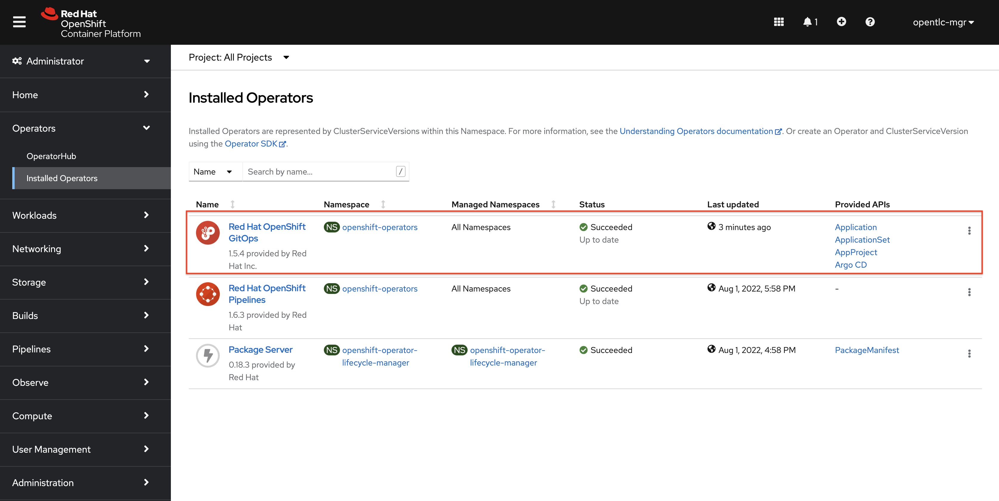


Antes de instalar o Gitea, ajustar o hostname em values.yaml para ficar com o cluster correto. Segue abaixo um comando de exemplo com sed para ajustar o host do Gitea.  

```
find . -type f -name '*.yaml' -exec sed -i '' s/gitea-oqss-cicd.apps.cluster-97wkc.97wkc.sandbox1266.opentlc.com/gitea-oqss-cicd.apps.cluster-42jck.42jck.sandbox1281.opentlc.com/g {} +
```

### Instalar o Gitea, Sonarqube e Nexus com helm

```
helm upgrade --install cnp --namespace oqss-cicd .
```

Na rota do Gitea adicionar o tls.
```
  tls:
    termination: edge
    insecureEdgeTerminationPolicy: Allow
```

Alterar a senha do Sonarqube de admin/admin para admin/admin123.

Ajustar o Sonar para acesso sem autenticação.
- Desmarcar em Administration / Security / Force user authentication, conforme imagem abaixo.

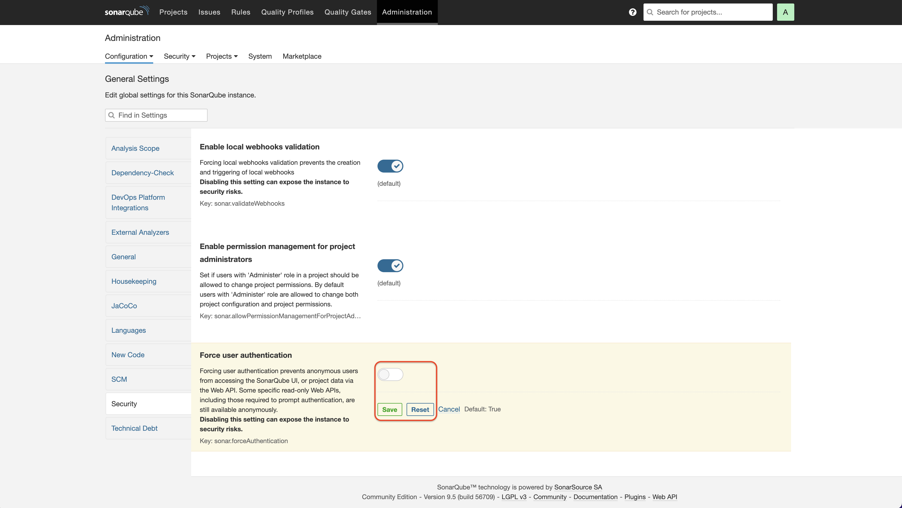

## Instalar o OpenShift Pipelines Operator

Execute o comando abaixo para instalação do OpenShift Pipeline Operator. Caso já tenha instalado pule esta etapa.

```
cat <<EOF | oc apply -f -
apiVersion: operators.coreos.com/v1alpha1
kind: Subscription
metadata:
  name: openshift-pipelines-operator
  namespace: openshift-operators
spec:
  channel: stable
  name: openshift-pipelines-operator-rh
  source: redhat-operators
  sourceNamespace: openshift-marketplace
EOF
```

Confirmar que OpenShift Pipelines Operator foi instalado com sucesso.

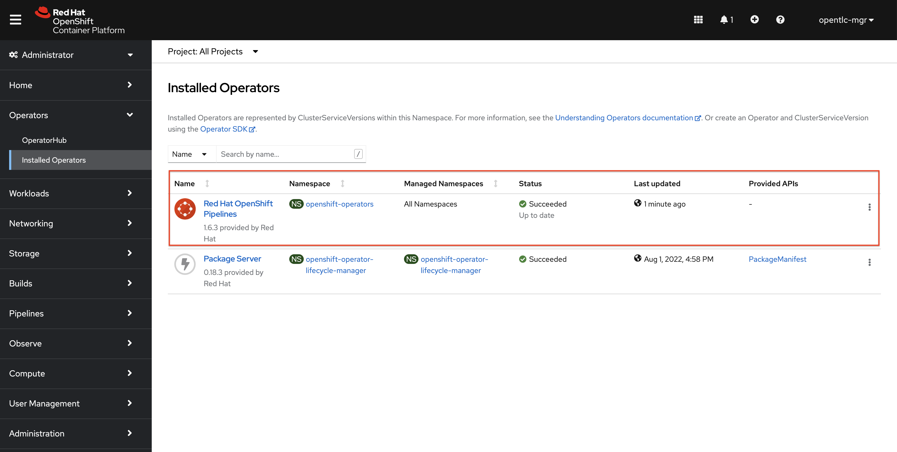

## Instalar os recursos do Pipeline com helm

Ajustar o cluster em values.yaml. Segue abaixo um comando de exemplo com sed para ajustar o host do cluster.

```
cd openshift-cicd-pipeline

CLUSTER_NEW=cluster-42jck.42jck.sandbox1281.opentlc.com
CLUSTER_OLD=cluster-97wkc.97wkc.sandbox1266.opentlc.com
find . -type f -name '*.yaml' -exec sed -i '' s/$CLUSTER_OLD/$CLUSTER_NEW/g {} +
```

Instalar os recursos com helm.
```
oc project oqss-cicd
helm template -f ./values.yaml . | oc apply -f-
```
Ajustar o cluster das rotas do repositório de configuração.  

```
cd openshift-cicd-app-eap-config

CLUSTER_NEW=cluster-42jck.42jck.sandbox1281.opentlc.com
CLUSTER_OLD=cluster-5l4b7.5l4b7.sandbox1903.opentlc.com
find . -type f -name '*.yaml' -exec sed -i '' s/$CLUSTER_OLD/$CLUSTER_NEW/g {} +
git add .
git commit -m "WIP"
git push
```

## Aplicar as Policies

Aplicar as policies com o comando abaixo para dar as permissões necessárias nos projetos.

```

oc policy add-role-to-user system:image-puller system:serviceaccount:oqss-cicd:pipeline  --namespace=oqss-dev
oc policy add-role-to-user system:image-puller system:serviceaccount:oqss-cicd:pipeline  --namespace=oqss-hom
oc policy add-role-to-user system:image-puller system:serviceaccount:oqss-cicd:pipeline  --namespace=oqss-prod

oc adm policy add-role-to-user edit system:serviceaccount:oqss-cicd:pipeline -n oqss-cicd
oc adm policy add-role-to-user edit system:serviceaccount:oqss-cicd:pipeline -n oqss-dev
oc adm policy add-role-to-user edit system:serviceaccount:oqss-cicd:pipeline -n oqss-hom
oc adm policy add-role-to-user edit system:serviceaccount:oqss-cicd:pipeline -n oqss-prod

```

## Pipeline
O objetivo é criar um Pipeline para execução de uma esteira responsável pelo deploy da aplicação nos ambientes de desenvolvimento e homologação, para produção haverá uma aprovação manual e será disponibilizada através de um pull request no repositório de configuração GitOps. 

Ele contém as principais etapas de um processo de integração e entrega contínua de software.

### Ambiente de desenvolvimento

 Um único Pipeline atende os ambientes de desenvolvimento e homologação. O controle de qual ambiente será executado fica a cargo da branch que inicia o processo -> ex. develop para desenvolvimento e release/hotfix para homologação. 
 Para desenvolvimento não é executado a Task de promoção Pull Request.

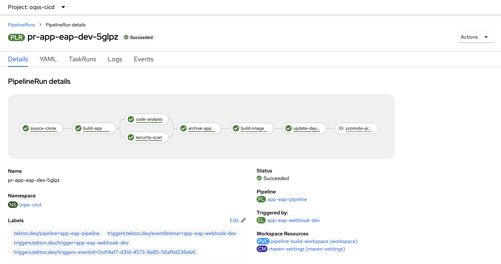

### Ambiente de homologação

 Neste ambiente todas as Tasks são executadas, inclusive a de promoção Pull Request com a finalidade de promover a imagem para o ambiente de produção. 

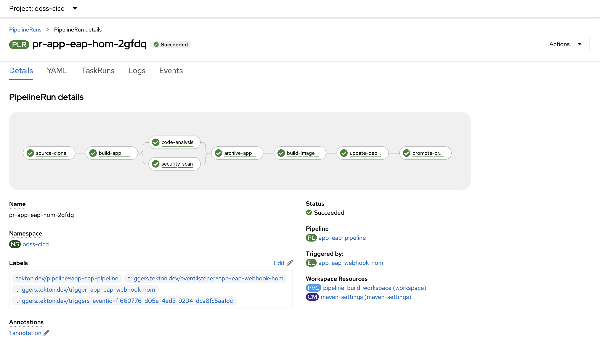

 ### Ambiente de produção

Para promover a aplicação para o ambiente de produção vá para o Gitea, acesse o repositório de configuração, na tab de pull request e aceite o pull request gerado pelo Pipeline de homologação. Desta maneira, ao realizar o merge será executado o deploy no ambiente de produção.

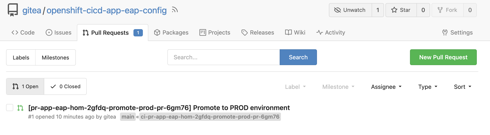


Aplicação em execução no cluster.

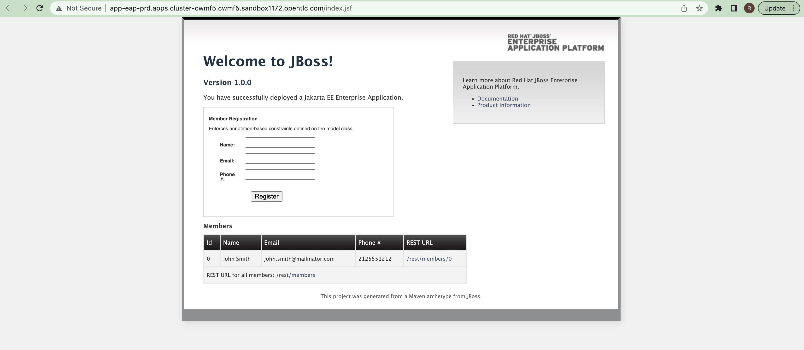

Aplicações no ArgoCD.

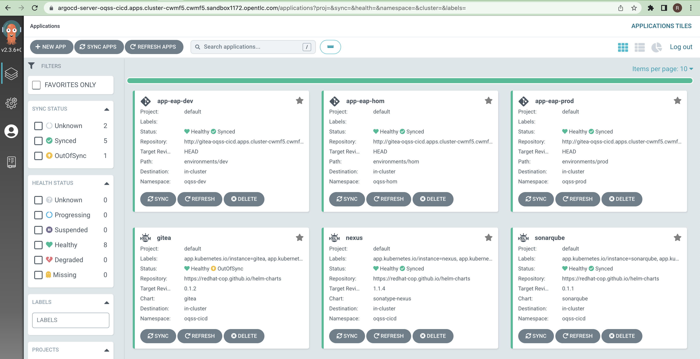

## Troubleshooting

Caso o webhook não tenha sido configurado no Gitea, uma possível falha é sua execução antes do repositório estar disponivel. 
`Para ajustar delete as TaskRuns do webhooks (tr-create-app-eap-webhook-dev e tr-create-app-eap-webhook-hom) e execute o helm novamente. Outra opção é adionar o webhook diretamento no repositório de código fonte da aplicação no Gitea.`

---
Erro no pipeline build-image -> warning: unsuccessful cred copy: ".docker" from "/tekton/creds" to "/": unable to create destination directory: mkdir /.docker: permission denied
> OpenShift Pipelines Task is failing after upgrading the Operator in RHCOP
https://access.redhat.com/solutions/6956010
Workaround
Modify feature-flags ConfigMap in openshift-pipelines namespace to be as follow:

```
apiVersion: v1
data:
  disable-affinity-assistant: "true"
  disable-creds-init: "false"
  disable-home-env-overwrite: "false"            ## <-- change from "true" to "false"    
  disable-working-directory-overwrite: "false"   ## <-- change from "true" to "false"    
  enable-api-fields: stable
  enable-custom-tasks: "false"
  enable-tekton-oci-bundles: "false"
  require-git-ssh-secret-known-hosts: "false"
  running-in-environment-with-injected-sidecars: "true"
kind: ConfigMap
```
---
Erro no pipeline build-image.

```
STEP-PUSH-TAG
Getting image source signatures
unauthorized: authentication required
level=error msg="exit status 1"
```

`Aplicar as Policies.`

---
Erro no Nexus, a aplicação não sobe.
```
id: cannot find name for user ID 1000680000 
```
`Aumentar os limits e requests de memoria para 6 GiB e cpu para request 1 e limit 2.`

## Referências

- Container Native Pipelines - Infrastructure
https://gitlab.consulting.redhat.com/consulting-brazil/applicationpractice/quick-starts/oqss/cnp/openshift-cicd-infra
- Tekton-demo
 https://github.com/redhat-cop/helm-charts/tree/master/charts/tekton-demo
- CI/CD Demo with Tekton and Argo CD on OpenShift
https://github.com/siamaksade/openshift-cicd-demo